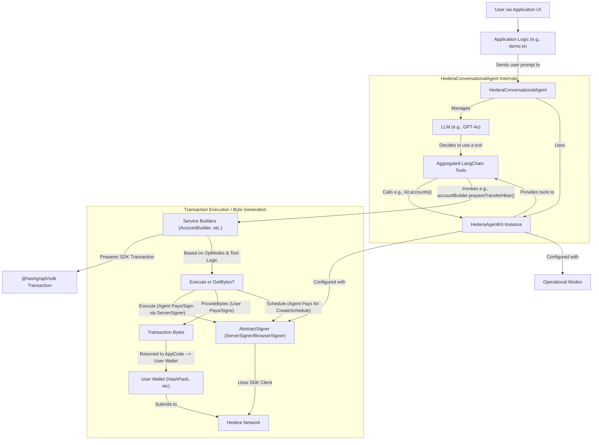

# @hashgraphonline/hedera-agent-kit

Build LLM-powered applications that interact with the Hedera Network. Create conversational agents that can understand user requests in natural language and execute Hedera transactions, or build backend systems that leverage AI for on-chain operations.

## Key Features

*   **Conversational Hedera**: Easily build chat-based interfaces for Hedera actions.
*   **Flexible Transaction Handling**:
    *   **Direct Execution**: For autonomous agents or backend control.
    *   **Provide Bytes**: For user-centric apps where users sign with their own wallets (e.g., HashPack via WalletConnect).
    *   **Scheduled Transactions**: Built-in support for "human-in-the-loop" workflows, where AI prepares transactions for user review and approval.
*   **Comprehensive Toolset**: Pre-built tools for HTS, HCS, HBAR transfers, account management, files, and smart contracts.
*   **Extensible**: Add your own custom tools with the plugin system.
*   **Simplified SDK Interaction**: Abstracts away much of the Hedera SDK boilerplate.

## Installation

```bash
npm install @hashgraphonline/hedera-agent-kit @hashgraph/sdk zod @langchain/openai @langchain/core
# or
yarn add @hashgraphonline/hedera-agent-kit @hashgraph/sdk zod @langchain/openai @langchain/core
```
*(Ensure you have `dotenv` for environment variable management if you use `.env` files.)*

## Quick Start: Your First Conversational Hedera Agent

This example demonstrates setting up the `HederaConversationalAgent` for a user-centric scenario where the user signs scheduled transactions. The agent's operator account will pay to create the schedule, and the user's account will be set to pay for the actual scheduled transaction when it's signed and submitted by the user.

**1. Set up your `.env` file:**

```env
OPENAI_API_KEY="sk-..."
# Agent's Operator Account (pays for creating schedules)
AGENT_OPERATOR_ID="0.0.YOUR_AGENT_OPERATOR_ID"
AGENT_OPERATOR_KEY="your_agent_operator_private_key"
# User's Account (will be the payer of the scheduled transaction, and signs the ScheduleSign)
USER_ACCOUNT_ID="0.0.YOUR_USER_ACCOUNT_ID"
```

**2. Create `demo.ts`:**

```typescript
import { HederaConversationalAgent, ServerSigner } from '@hashgraphonline/hedera-agent-kit';
import { ChatOpenAI } from "@langchain/openai";
import * as readline from 'node:readline/promises';
import { stdin as input, stdout as output } from 'node:process';
import dotenv from 'dotenv';

dotenv.config();

async function main() {
  if (!process.env.AGENT_OPERATOR_ID || !process.env.AGENT_OPERATOR_KEY || !process.env.OPENAI_API_KEY || !process.env.USER_ACCOUNT_ID) {
    console.error("Please ensure AGENT_OPERATOR_ID, AGENT_OPERATOR_KEY, USER_ACCOUNT_ID, and OPENAI_API_KEY are in your .env file.");
    return;
  }

  const agentOperatorSigner = new ServerSigner(
    process.env.AGENT_OPERATOR_ID,
    process.env.AGENT_OPERATOR_KEY,
    'testnet' // or 'mainnet'
  );
  const userAccountId = process.env.USER_ACCOUNT_ID;

  const agent = new HederaConversationalAgent(agentOperatorSigner, {
    llm: new ChatOpenAI({ modelName: "gpt-4o-mini", temperature: 0.1 }),
    userAccountId: userAccountId,
    operationalMode: 'provideBytes',
    scheduleUserTransactionsInBytesMode: true,
    verbose: false, 
  });
  await agent.initialize();

  console.log("Hedera Agent is ready!");
  console.log(`  Agent Operator: ${agentOperatorSigner.getAccountId()}`);
  console.log(`  User Account: ${userAccountId}`);
  console.log(`  Mode: provideBytes, User Txns Scheduled: true`);
  console.log("\nExample: 'Schedule a transfer of 0.1 HBAR from my account to 0.0.123'");
  console.log("Type 'exit' to quit.\n");

  const rl = readline.createInterface({ input, output });
  const chatHistory: { type: string, content: string }[] = [];
  let lastScheduleId: string | null = null;

  while (true) {
    const userInput = await rl.question('You: ');
    if (userInput.toLowerCase() === 'exit') {
      rl.close();
      break;
    }

    chatHistory.push({ type: 'human', content: userInput });
    let agentResponse = await agent.processMessage(userInput, chatHistory);
    console.log(`Agent: ${agentResponse.output}`);
    chatHistory.push({ type: 'ai', content: agentResponse.output });

    if (agentResponse.scheduleId) {
      lastScheduleId = agentResponse.scheduleId.toString();
      console.log(`SYSTEM: Transaction was scheduled. Schedule ID: ${lastScheduleId}`);
      const confirmSign = await rl.question(`SYSTEM: Prepare transaction to sign for schedule ${lastScheduleId}? (yes/no) > `);
      
      if (confirmSign.toLowerCase() === 'yes') {
        const signPrompt = `Yes, prepare to sign schedule ${lastScheduleId} using my account.`;
        chatHistory.push({ type: 'human', content: signPrompt });
        agentResponse = await agent.processMessage(signPrompt, chatHistory);
        console.log(`Agent: ${agentResponse.output}`);
        chatHistory.push({ type: 'ai', content: agentResponse.output });
      } else {
        console.log("SYSTEM: OK. You can ask to sign it later using the Schedule ID.");
        lastScheduleId = null; 
      }
    }

    if (agentResponse.transactionBytes) {
      console.log(`SYSTEM: Transaction bytes for account ${userAccountId} to sign and submit:`);
      console.log(agentResponse.transactionBytes);
      console.log("SYSTEM: (In a real app, pass these to a wallet for signing and submission.)");
      lastScheduleId = null; 
    }
    
    if (chatHistory.length > 10) chatHistory.splice(0, chatHistory.length - 10); // Keep history trimmed
  }
}

main().catch(console.error);
```

**3. Run the demo:**

```bash
npm install -g tsx # If you don't have tsx installed globally
tsx demo.ts
```

**Example Interaction:**

```
You: Schedule a transfer of 0.1 HBAR from my account to 0.0.34567
Agent: Okay, I have scheduled a transfer of 0.1 HBAR from your account (0.0.USER_ACCOUNT_ID) to 0.0.34567. The Schedule ID is 0.0.xxxxxx.
SYSTEM: Transaction was scheduled. Schedule ID: 0.0.xxxxxx
SYSTEM: Prepare transaction to sign for schedule 0.0.xxxxxx? (yes/no) > yes
You: Yes, prepare to sign schedule 0.0.xxxxxx using my account.
Agent: Alright, I have prepared the ScheduleSign transaction for you. Please use the following transaction bytes to sign and submit it with your account (0.0.USER_ACCOUNT_ID).
SYSTEM: Transaction bytes for account 0.0.USER_ACCOUNT_ID to sign and submit:
[Transaction Bytes Output Here]
SYSTEM: (In a real app, pass these to a wallet for signing and submission.)
```

## Core Concepts

Understanding these concepts will help you make the most of the Hedera Agent Kit:

*   **`HederaConversationalAgent`**: The primary interface for building chat-based applications. It combines the power of an LLM with the Hedera-specific tools provided by `HederaAgentKit`.
*   **`HederaAgentKit`**: The core engine that bundles tools, manages network clients, and holds the `signer` configuration. It's used internally by `HederaConversationalAgent` but can also be used directly for more programmatic control.
*   **Signers (`AbstractSigner`)**: Determine how transactions are signed and paid for:
    *   `ServerSigner`: Holds a private key directly. Useful for backend agents where the agent's account pays for transactions it executes.
    *   `BrowserSigner` (Conceptual for this README): Represents integrating with a user's browser wallet (e.g., HashPack). The agent prepares transaction bytes, and the user signs and submits them via their wallet.
*   **Operational Modes**: Configure how the agent handles transactions:
    *   `operationalMode: 'directExecution'`: Agent signs and submits all transactions using its `signer`. The agent's operator account pays.
    *   `operationalMode: 'provideBytes'`: Agent returns transaction bytes. Your application (and the user, via their wallet) is responsible for signing and submitting. This is key for user-centric apps.
    *   `scheduleUserTransactionsInBytesMode: boolean` (Default: `true`): When `operationalMode` is `'provideBytes'`, this flag makes the agent automatically schedule transactions initiated by the user (e.g., "transfer *my* HBAR..."). The agent's operator pays to *create the schedule entity*, and the user pays for the *actual scheduled transaction* when they sign the `ScheduleSignTransaction`.
    *   `metaOptions: { schedule: true }`: Allows the LLM to explicitly request scheduling for any tool call, overriding defaults.
*   **Human-in-the-Loop Flow**: The Quick Start example demonstrates this. The agent first creates a schedule (agent pays). Then, after user confirmation, it prepares a `ScheduleSignTransaction` (user pays to sign and submit this, triggering the original scheduled transaction).

## Available Tools

(Previously generated list of tools will be inserted here - keeping it concise for now)

**Account Service Tools:**
*   `hedera-account-transfer-hbar`, `hedera-account-create`, `hedera-sign-and-execute-scheduled-transaction`, etc.

**HTS Tools:**
*   `hedera-hts-create-fungible-token`, `hedera-hts-mint-nft`, etc.

**HCS, File, Smart Contract Tools:**
*   (List major tools for each service)

*(A more detailed tool reference can be found at [LINK TO TOOL DOCS - TBD])* 

## Advanced Usage

### Using `HederaAgentKit` Directly

```typescript
import { HederaAgentKit, ServerSigner, Hbar } from '@hashgraphonline/hedera-agent-kit';
// Ensure Hbar is also exported from the main package index if not already

async function useKitDirectly() {
  const signer = new ServerSigner(process.env.AGENT_OPERATOR_ID!, process.env.AGENT_OPERATOR_KEY!, 'testnet');
  const kit = new HederaAgentKit(signer, undefined, 'directExecution'); 
  await kit.initialize();

  const transferParams = {
    transfers: [
      { accountId: '0.0.SOME_RECIPIENT', amount: new Hbar(1) },
      { accountId: signer.getAccountId().toString(), amount: new Hbar(-1) }
    ],
    memo: 'Direct kit HBAR transfer'
  };
  const result = await kit.accounts().transferHbar(transferParams).execute();
  console.log('Direct HBAR Transfer Result:', result);
}
// useKitDirectly();
```

### Plugin System

(Existing content can be kept and slightly condensed if needed)

## Mermaid Diagram: Agent Interaction Flow



## Local Development

1. **Clone** the repo:

```bash
git clone https://github.com/hedera-dev/hedera-agent-kit.git
```

2. Install dependencies:

```bash
cd hedera-agent-kit
npm install
```

3. Configure environment variables (e.g., `OPENAI_API_KEY`, `HEDERA_ACCOUNT_ID`, `HEDERA_PRIVATE_KEY`) in a `.env` file.

4. Test the kit:

```bash
 npm run test
```

## Contributing

We welcome contributions! Please see our [CONTRIBUTING.md](https://github.com/hedera-dev/hedera-agent-kit/blob/main/CONTRIBUTING.md) for details on our process, how to get started, and how to sign your commits under the DCO.

## License

Apache 2.0