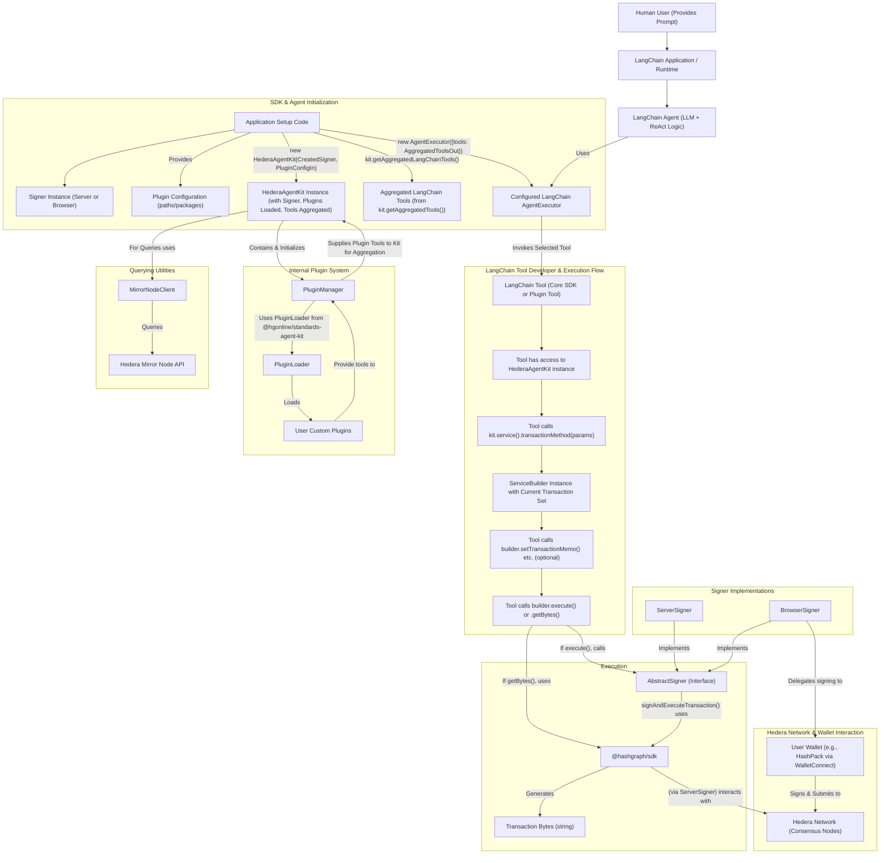

# Hedera Agent Kit

Welcome to the **Hedera Agent Kit**! This project aims to provide a LangChain-compatible toolkit for interacting with the Hedera Network. The focus is on a minimal, easy-to-use set of functions, while staying flexible for future enhancements.

## Overview

- **Agent Interaction**: Make on-chain calls to Hedera (e.g., create tokens, post messages to consensus).
- **Lightweight**: Designed to get you started quickly with a minimal set of features.
- **Community-Driven**: We encourage developers of all skill levels to contribute.

## Current Features

1. **Native Hedera Token Service (HTS)**:
    - Create fungible tokens with minimal parameters (name, symbol, decimals, supply, etc.).
    - Mint additional tokens to existing token accounts.

2. **Token Operations**:
    - **Create Fungible Tokens (FT)**: Easily create and configure new fungible tokens.
    - **Create Non-fungible Tokens (NFT)**: Easily create and configure new non-fungible tokens.
    - **Transfer Tokens**: Transfer tokens between accounts.
    - **Associate / Dissociate Tokens**: Associate a token to an account or dissociate it as needed.
    - **Reject Tokens**: Reject a token from an account.

3. **HBAR Transactions**:
    - Transfer HBAR between accounts.

4. **Airdrop Management**:
    - Airdrop tokens to multiple recipients.
    - Claim a pending airdrop.

5. **Token Balance Queries**:
    - Get HBAR balances of an account.
    - Get HTS token balances for a specific token ID.
    - Retrieve all token balances for an account.
    - Get token holders for a specific token.

6. **Topic Management (HCS)**:
    - **Create Topics**: Create new topics for Hedera Consensus Service (HCS).
    - **Delete Topics**: Delete an existing topic.
    - **Submit Topic Messages**: Send messages to a specific topic.
    - **Get Topic Info**: Retrieve information about a specific topic.
    - **Get Topic Messages**: Fetch messages from a specific topic.

## Target Architecture Overview (Simplified Flow Diagram)



**Diagram Flow Explanation (Developer UX Focus):**

- **Phase 1: Application Setup (Done Once by App Developer)**

  1.  The application developer creates a `signer` (`ServerSigner` or `BrowserSigner`).
  2.  They define `pluginConfig` (listing plugin paths/packages for custom tools).
  3.  They instantiate `HederaAgentKit` with this `signer` and `pluginConfig`.
      - During `HederaAgentKit` construction, its internal `PluginManager` is created. This `PluginManager` is responsible for using the `PluginLoader` from `@hashgraphonline/standards-agent-kit` to load plugins based on the `pluginConfig`.
      - The `HederaAgentKit`'s `async initialize()` method must then be called. This method completes plugin initialization (by calling `pluginManager.initializePlugins()`) and then aggregates all tools: its own core tools, HCS10 tools (if applicable), and all tools from the now-loaded plugins.
  4.  The developer then calls `const allTools = kit.getAggregatedLangChainTools();` to retrieve this combined list.
  5.  These `allTools` are used to configure the main LangChain AgentExecutor.

- **Phase 2: LangChain Agent & Tool Operation (For Each User Prompt)**

  1.  User prompts LangChain App, which invokes Agent.
  2.  Agent selects a Tool.
  3.  The Tool's `_call` method uses its `HederaAgentKit` instance (obtained via constructor or `PluginContext`) to get a service builder: `const hcsBuilder = this.kit.hcs();`.
  4.  The Tool then calls a method on the service builder to specify the transaction and its main parameters: `hcsBuilder.createTopic(params);`.
  5.  Optionally, further common configurations can be chained: `hcsBuilder.setTransactionMemo("My Memo");`.
  6.  Finally, the Tool calls `await hcsBuilder.execute()` or `await hcsBuilder.getTransactionBytes()`.

- **Phase 3: SDK Internal Action & Hedera Interaction:**
  - `builder.execute()`: The builder constructs the transaction and uses `this.signer.signAndExecuteTransaction()`.
  - `builder.getTransactionBytes()`: The builder constructs the transaction using `@hashgraph/sdk` and serializes it.
  - The specific `signer` implementation then handles interaction with the Hedera network.

This flow makes `HederaAgentKit` a self-contained unit that, once initialized, provides everything needed, including all aggregated tools, through its own API.


### Note
The methods in the HederaAgentKit class are fully implemented and functional for interacting with the Hedera network (e.g., creating tokens, transferring assets, managing airdrops). However, Langchain tools for most of these methods and operations are not implemented by default.

### Details
For further details check [HederaAgentKit Readme](./src/agent/README.md).

## Getting Started

```bash
npm i hedera-agent-kit
```

LangChain/ LangGraph quick start:

```js
import { HederaAgentKit, createHederaTools } from 'hedera-agent-kit';
import { ToolNode } from '@langchain/langgraph/prebuilt';

const hederaAgentKit = new HederaAgentKit(
  '0.0.12345', // Replace with your account ID
  '0x.......', // Replace with your private key
  'testnet',   // Replace with your selected network
);
const hederaAgentKitTools = createHederaTools(hederaAgentKit);
const toolsNode = new ToolNode(tools);

```
- `hederaAgentKitTools` is an array of `Tool` instances
  (from `@langchain/core/tools`).
- `toolsNode` can be used in any LangGraph workflow,
  for example `workflow.addNode('toolsNode', toolsNode)`.

## Local development

1. **Clone** the repo:

```bash
git clone https://github.com/hedera-dev/hedera-agent-kit.git
```

2. Install dependencies:

```bash
cd hedera-agent-kit
npm install
```

3. Configure environment variables (e.g., `OPENAI_API_KEY`, `HEDERA_ACCOUNT_ID`, `HEDERA_PRIVATE_KEY`) in a `.env` file.

4. Test the kit:

```bash
 npm run test
```

## Contributing

We welcome contributions! Please see our [CONTRIBUTING.md](https://github.com/hedera-dev/hedera-agent-kit/blob/main/CONTRIBUTING.md) for details on our process, how to get started, and how to sign your commits under the DCO.


## License

Apache 2.0
